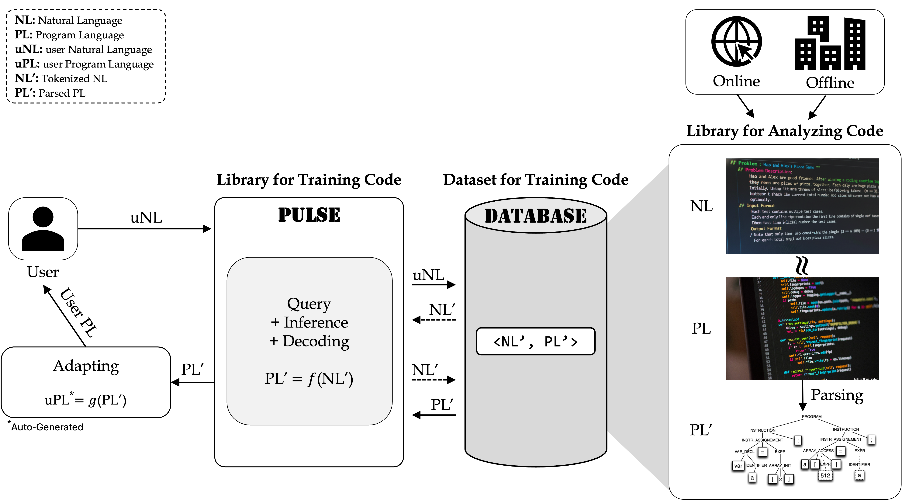

[![Contributors][contributors-shield]][contributors-url]
[![Forks][forks-shield]][forks-url]
[![Stargazers][stars-shield]][stars-url]
[![Issues][issues-shield]][issues-url]
[![Unlicense License][license-shield]][license-url]

<!-- PROJECT LOGO -->
 

  

  <h3 align="center">A Database Infrastructure in PULSE</h3>

  

     From Ingestion to Management
     
    <a href="https://github.com/auto-code-etri/autocode_dataset/issues/new?labels=bug">Report Bug</a>
    &middot;
    <a href="https://github.com/auto-code-etri/autocode_dataset/issues/new?labels=enhancement&template=feature-request---.md">Request Feature</a>
     
     
    PULSE - Pipeline for Unified LLM Software Engineering
     
    <a href="https://github.com/auto-code-etri/autocode"><strong>Explore the PULSE »</strong></a>
     
  

<!-- TABLE OF CONTENTS -->

  
Table of Contents

  <ol>
    <li>
      <a href="#about-the-project">About The Project</a>
      <ul>
        <li><a href="#data-infrastrcture-pipeline">Data Infrastructure Pipeline</a></li>
        <li><a href="#composition">Composition</a></li>
        <li><a href="#requirements">Requirements</a></li>
      </ul>
    </li>
    <li><a href="#dataset-description">Dataset Description</a></li>
    <li>
      <a href="#getting-started">Getting Started</a>
      <ul>
        <li><a href="#crawling-code-for-github-project">Crawling Code for GitHub Project</a></li>
      </ul>
    </li>
    <li><a href="#contributing">Contributing</a></li>
    <li><a href="#license">License</a></li>
    <li><a href="#acknowledgment">Acknowledgment</a></li>
  </ol>

## About The Project

  

 

This repository provides a unified collection of code datasets and crawling tools for large-scale software engineering and code intelligence research.

It covers diverse code sources — including coding contests, benchmark datasets, open repositories, and programming communities — enabling a comprehensive approach to data utilization and analysis.

The project integrates data from multiple well-known sources, such as:
  - [![CodeSearchNet][CodeSearchNet]][CodeSearchNet-url]
  - [![GitHub][Github.com]][Github-url]
  - [![StackOverflow][StackOverflow]][StackOverflow-url]
  - [![HumanEval][HumanEval]][HumanEval-url]
  - [![MBPP][MBPP]][MBPP-url]
  - secure code

Together, these datasets and tools establish a comprehensive data infrastructure that supports unified, data-driven research in code understanding, generation, and secure software engineering.

This infrastructure also serves as the data foundation for [![PULSE][pulse-logo]][pulse-url] — **P**ipeline for **U**nified **L**LM **S**oftware **E**ngineering — framework that automatically generates expert-level, high-quality source code from natural language requirements.

(<a href="#readme-top">back to top</a>)

### Data Infrastructure Pipeline

### Composition

Building a database infrastructure that can be used for additional research of software generation by learning and analyzing codes, documents, and metadata in the source code repository in the future

>- Database storage technology that can be used for program creation/SW analysis

>- Information model technology for generating program source code and improving accuracy of expression

>- Database technology with a structure that facilitates the addition/deletion of source codes within the company

>- Description of code generation evaluation method reflecting actual needs such as code search, summary, and completion

### Requirements

>- Multiple source code collection systems provided by multiple organizations must be provided. 
   Currently, Sungkyunkwan University and Suresoft company are in charge of collecting source codes, and the relevant institutions must collect and store data sets according to some guidelines.

>- A system that individually processes the collected source codes must be provided. 
   In addition, source code and natural language should be processed so that they can be easily and immediately used in a third form such as AST or PDG, 
   which can structurally reflect the control and data flow of the program, rather than being stored as they are.

>- It has a data set in which the collected source code and natural language are stored in the form of a database, 
   and a system for using the source code data set that can be extracted from outside using a specific API must be provided.

>- A inter-conversion system between NL and PL must be provided for automatic generation of ML-based source code

>- Automatic generation system of ML-based source code must provide multiple most appropriate source codes

>- When a user makes a query using NL, a function that converts the automatically generated source code to suit the user's environment must be provided.

>- The automatic source code generation system must be provided in the API form so that third parties can easily use it from the outside.

(<a href="#readme-top">back to top</a>)

## Dataset Description
[`CodeSearchNet-Python`][CodeSearchNet-Python-url]
- This directory contains an augmented dataset based on Python source code from the CodeSearchNet dataset. 
- The original dataset consists of natural language (problem):code pairs, and in this version, the natural language part has been enhanced. 
- In addition to the original problem description, we added solution strategies and pseudocode to enrich the natural language component. 
-This augmented dataset can help improve the ability to find the correct code solutions for given problems.

[`Github-Cpp-2024`][Github-Cpp-2024-url]
- This directory contains C/C++ source codes that were crawled, filtered, and collected from GitHub. 
- In particular, during the filtering process, the source codes were scored, and low-quality codes were removed. 
- Additionally, the natural language descriptions for the codes were generated using an LLM, resulting in a complete dataset in the form of (natural language : code) pairs.

[`MutMut`][MutMut-url]
- The MutMut dataset was created by applying minor code mutations using a mutation testing tool, with the goal of generating faulty code that fails to pass test cases. 
- These mutations involve various techniques, such as renaming variables, changing operators, and modifying statements—typically at the line level. 
- By applying these transformations to an existing dataset, a collection of buggy code samples was produced.

[`SecureCode-Python`][SecureCode-Python-url]
- The Secure Code dataset refines the Py150K dataset, ensuring compatibility with Python 3, and applies static analysis to classify the code as secure. 
- Potentially vulnerable snippets are manually reviewed by security experts, following strict guidelines and cross-validation, to preserve their original functionality. 
- The dataset consists of secure code snippets, with deduplication measures in place to prevent data leakage between fine-tuning and evaluation sets.

(<a href="#readme-top">back to top</a>)

## Getting Started
### Crawling Code for Github Project

[`GithubCrawling`][GithubCrawling-url]

This directory contains two crawlers — the **GitHub Crawler** and the **StackOverflow Crawler** — which provide source code for searching projects on each platform and crawling their corresponding source files.

For more details on getting started with each crawler, including installation and usage instructions, see each project’s README:
- [GitHub Crawler README][GithubCrawler-url]
- [Stack Overflow Crawler README][StackOverflowCrawler-url]

Although the target source codes are written in C/C++ and Python, there is no language restriction if the code is modified accordingly.

(<a href="#readme-top">back to top</a>)

<!-- CONTRIBUTING -->
## Contributing

Contributions are what make the open source community such an amazing place to learn, inspire, and create. 

Any contributions you make are **greatly appreciated**.

If you have a suggestion that would make this better, please fork the repo and create a pull request. 

You can also simply [open an issue](https://github.com/auto-code-etri/autocode_dataset/issues/new?labels=enhancement) with the tag "`enhancement`."

**🌟 Don't forget to give the project a star!🌟 Thanks again!**

1. Fork the Project
2. Create your Feature Branch (`git checkout -b feature/YourFeatureName`)
3. Commit your Changes (`git commit -m 'Add some YourFeatureName'`)
4. Push to the Branch (`git push origin feature/YourFeatureName`)
5. Open a Pull Request

### Contributors:

(<a href="#readme-top">back to top</a>)

<!-- LICENSE -->
## License

Copyright *On-Device AI Model Research Laboratory, ETRI*.

All rights reserved. For more details, see `LICENSE.txt`.

(<a href="#readme-top">back to top</a>)

<!-- ACKNOWLEDGMENTS -->
## Acknowledgment
> This work was supported by Institute of Information & communications Technology Planning & Evaluation (IITP) grant funded by the Korea government(MSIT) (No.2022-0-00995, Automated reliable source code generation from natural language descriptions)

> 이 논문은 2025년도 정부(과학기술정보통신부)의 재원으로 정보통신기획평가원의 지원을 받아 수행된 연구임 (No.2022-0-00995, 자연어로 기술된 요구사항에서 전문 개발자 수준의 고품질 코드를 자동 생성하는 기술 개발)

(<a href="#readme-top">back to top</a>)

<!-- MARKDOWN LINKS & IMAGES -->
<!-- https://www.markdownguide.org/basic-syntax/#reference-style-links -->
[contributors-shield]: https://img.shields.io/github/contributors/auto-code-etri/autocode_dataset.svg?style=for-the-badge
[contributors-url]: https://github.com/auto-code-etri/autocode_dataset/graphs/contributors
[forks-shield]: https://img.shields.io/github/forks/auto-code-etri/autocode_dataset.svg?style=for-the-badge
[forks-url]: https://github.com/auto-code-etri/autocode_dataset/network/members
[stars-shield]: https://img.shields.io/github/stars/auto-code-etri/autocode_dataset.svg?style=for-the-badge
[stars-url]: https://github.com/auto-code-etri/autocode_dataset/stargazers
[issues-shield]: https://img.shields.io/github/issues/auto-code-etri/autocode_dataset.svg?style=for-the-badge
[issues-url]: https://github.com/auto-code-etri/autocode_dataset/issues
[license-shield]: https://img.shields.io/badge/LICENSE-ETRI_copyright-blue?style=for-the-badge
[license-url]: https://github.com/auto-code-etri/autocode_dataset/blob/main/LICENSE.txt
[product-image]: assets/dataset.png
[CodeSearchNet]: https://img.shields.io/badge/CodeSearchNet-grey?style=for-the-badge
[CodeSearchNet-url]: https://arxiv.org/abs/1909.09436
[HumanEval]: https://img.shields.io/badge/HumanEval-grey?style=for-the-badge&logo=openai&&logoColor=whithe
[HumanEval-url]: https://arxiv.org/abs/2107.03374
[MBPP]: https://img.shields.io/badge/MBPP-grey?style=for-the-badge&&logo=google&logoColor=blue
[MBPP-url]: https://arxiv.org/abs/1909.09436
[Github.com]: https://img.shields.io/badge/GitHub-%23121011.svg?style=for-the-badge&logo=github&logoColor=white
[Github-url]: https://github.com/
[StackOverflow]: https://img.shields.io/badge/Stack%20Overflow-orange?style=for-the-badge&logo=stackoverflow&logoColor=white
[StackOverflow-url]: https://stackoverflow.com/
[pulse-logo]: https://img.shields.io/badge/</>_PULSE-365e9e?style=for-the-badge
[pulse-url]: https://github.com/auto-code-etri/autocode
[CodeSearchNet-Python-url]: https://github.com/auto-code-etri/autocode_dataset/tree/main/CodeSearchNet-Python
[Github-Cpp-2024-url]: https://github.com/auto-code-etri/autocode_dataset/tree/main/Github-Cpp-2024
[MutMut-url]: https://github.com/auto-code-etri/autocode_dataset/tree/main/MutMut
[SecureCode-Python-url]: https://github.com/auto-code-etri/autocode_dataset/tree/main/SecureCode-Python
[GithubCrawling-url]: https://github.com/auto-code-etri/autocode_dataset/tree/main/GithubCrawling
[GithubCrawler-url]: https://github.com/auto-code-etri/autocode_dataset/tree/main/GithubCrawling/Crawler%20(Source%20Code)/Github%20Crawler
[StackOverflowCrawler-url]: https://github.com/auto-code-etri/autocode_dataset/tree/main/GithubCrawling/Crawler%20(Source%20Code)/StackOverflow%20Crawler
